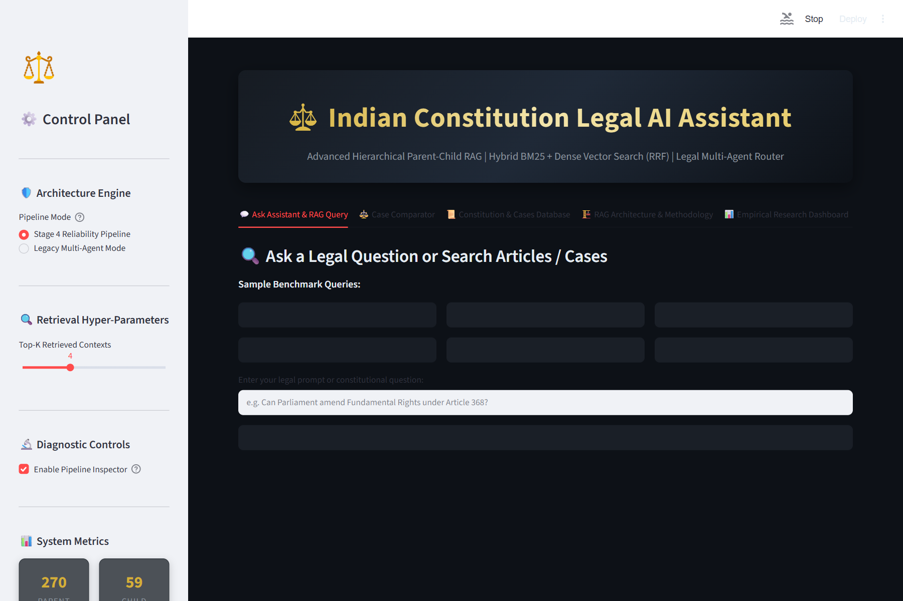
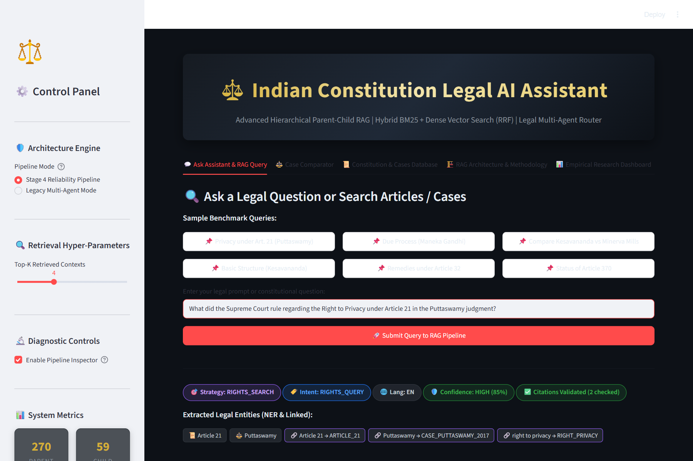
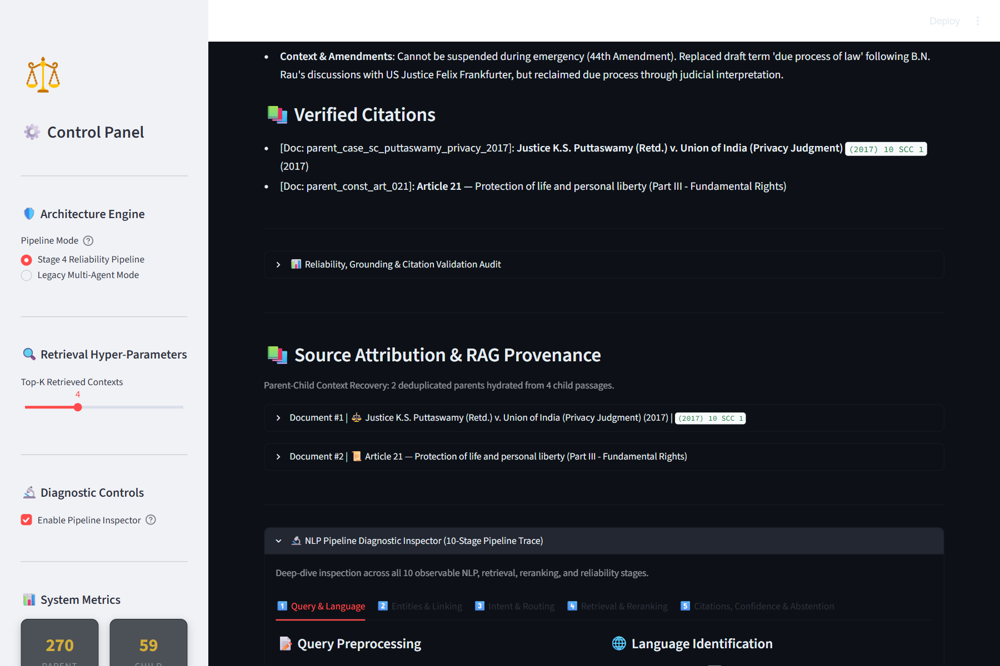
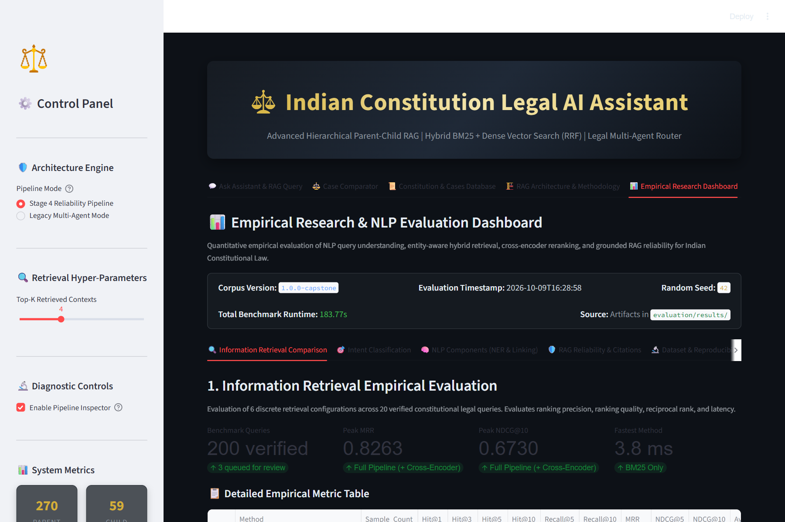
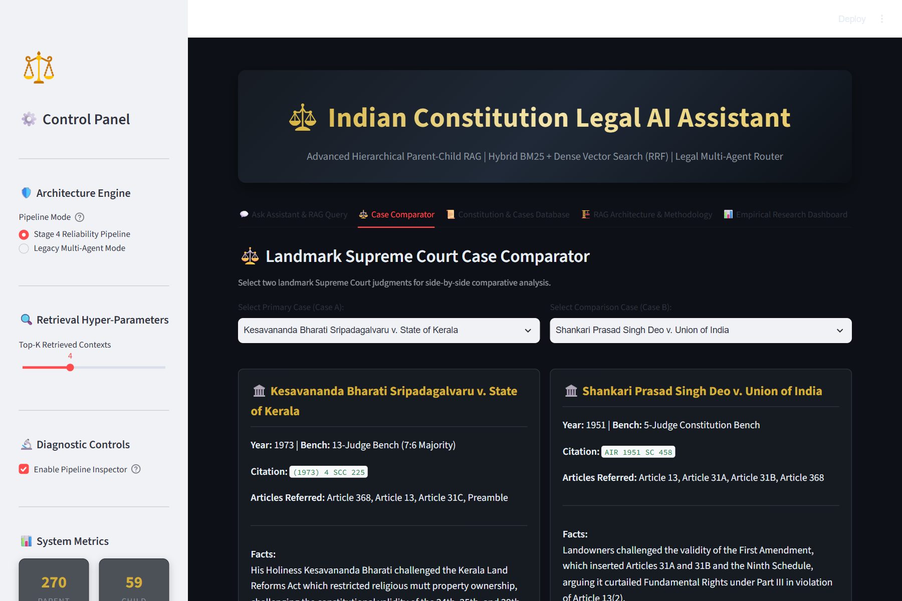
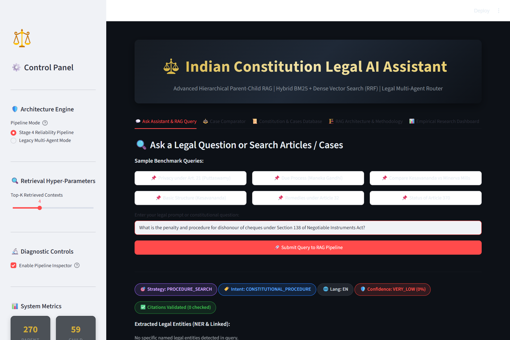

# Indian Constitution Legal AI Assistant — NLP Capstone

[](https://www.python.org/downloads/)
[](tests/)
[](app.py)
[](docs/INDEPENDENT_AUDIT_REPORT.md)

An empirical Natural Language Processing (NLP) and Information Retrieval (IR) framework for Question Answering over Indian Constitutional Law. Integrates domain-specific Legal Named Entity Recognition (NER), canonical entity linking, hybrid retrieval with Reciprocal Rank Fusion (RRF), Cross-Encoder neural reranking, evidence-grounded generation, structural citation validation, explainable confidence estimation, an interactive Research Dashboard, and a 10-stage NLP Pipeline Inspector.

**Research Title**: *Entity-Aware Hybrid Retrieval and Reranking Framework for Indian Constitutional Question Answering*

---

## 📖 Essential Documentation Links

- 📘 [**Master Learning Guide (`docs/PROJECT_GUIDE.md`)**](docs/PROJECT_GUIDE.md): **The primary comprehensive study and research guide (Chapters 1–15).**
- 🎓 [**Viva Defense & Examination Guide (`docs/viva_defense_guide.md`)**](docs/viva_defense_guide.md): 40+ viva questions, spoken answers, deep technical proofs, elevator pitch, and live demo script.
- 🏗️ [**System Architecture & Tech Spec (`docs/architecture.md`)**](docs/architecture.md): Detailed 16-stage pipeline architecture, Mermaid diagrams, component responsibilities, and mathematical formulations.
- 📜 [**Dataset & Corpus Provenance (`docs/dataset.md`)**](docs/dataset.md): Official legal sources, 270 parent documents, 1,001 vector passages, JSON schemas, chunking rules, and limitations.
- 🔬 [**Empirical Experiments & Findings (`docs/experiments.md`)**](docs/experiments.md): Full documentation of Experiments 1–8, dual retrieval matrix (Original vs. Canonical), and latency profiles.
- 📊 [**Evaluation Methodology & Metrics (`docs/evaluation.md`)**](docs/evaluation.md): Mathematical formulations for IR metrics (Hit@K, MRR, NDCG@K), NER exact-span metrics, and intent 5-fold cross-validation.
- 🛡️ [**Independent Adversarial Audit Report (`docs/INDEPENDENT_AUDIT_REPORT.md`)**](docs/INDEPENDENT_AUDIT_REPORT.md): Academic readiness verdict, overclaim corrections, and verified code changes.
- 🔍 [**Benchmark Quality & Independence Audit (`docs/BENCHMARK_QUALITY_REPORT.md`)**](docs/BENCHMARK_QUALITY_REPORT.md): Template repetition analysis, target concentration, and uncataloged target audit.
- 🧠 [**NER Forensic Error Analysis (`docs/NER_ERROR_ANALYSIS.md`)**](docs/NER_ERROR_ANALYSIS.md): Root-cause resolution for judge name extraction (`PERSON_TITLE_PATTERN`) and gazetteer memorization disclosures.
- ⚖️ [**RAG Grounding & Citation Audit (`docs/RAG_GROUNDING_AUDIT.md`)**](docs/RAG_GROUNDING_AUDIT.md): Structural validation mechanics vs. Natural Language Inference (NLI) semantic claim entailment.
- ⏱️ [**Reproducibility & Latency Profiling (`docs/REPRODUCIBILITY_REPORT.md`)**](docs/REPRODUCIBILITY_REPORT.md): CPU runtime profiles, warm-up benchmarks, and reproduction seeds.

---

## 📸 Application Screenshots

| Main Application & RAG Query | Evidence-Grounded Legal Synthesis |
|---|---|
|  |  |
| *Figure 1: Main interface with 270 parents, 1,001 child passages.* | *Figure 2: Grounded response with strategy, intent, and citations.* |

| 10-Stage NLP Pipeline Inspector | Empirical Research Dashboard |
|---|---|
|  |  |
| *Figure 3: Deep diagnostic trace across all 10 internal stages.* | *Figure 4: Empirical IR charts, latency curves, and intent matrices.* |

| Landmark Case Comparator | Automated Safe Abstention |
|---|---|
|  |  |
| *Figure 5: Side-by-side comparison of landmark Supreme Court rulings.* | *Figure 6: Automated refusal on out-of-scope non-constitutional queries.* |

---

## 1. Problem Statement & Research Motivation

Constitutional question answering in India presents three major NLP hurdles:
1. **Vocabulary Mismatch**: Citizen queries describe situations colloquially (*"can police search my phone without a warrant"*), which traditional keyword search misses; conversely, dense vector embeddings struggle with exact statutory references (*"Article 21"* vs *"Article 21A"*).
2. **Hierarchical Statutory Text**: Constitutional Articles contain nested clauses, sub-clauses, and cross-references. Single-size chunking either cuts sub-clauses in half or dilutes vector representations.
3. **Hallucination Risks**: General LLMs invent plausible but non-existent Supreme Court citations and holdings without verifiable evidentiary grounding.

### Core Research Contributions:
- **Hierarchical Parent-Child RAG**: Retrieves small child passages (~300 chars) for maximum vector search precision, hydrating complete parent Articles and Judgments (~1,200 chars) for generator synthesis.
- **Entity-Aware Hybrid Retrieval**: Standalone BM25Okapi + ChromaDB dense vector embeddings fused via Reciprocal Rank Fusion (RRF, $k=60$) with an additive $+0.15$ boost for recognized legal entities.
- **Cross-Encoder Neural Reranking**: Scores top-30 candidate pairs jointly via `cross-encoder/ms-marco-MiniLM-L-6-v2`, lifting NDCG@10 to **0.7787**.
- **Structural Citation Validation & Abstention**: Verifies citations against retrieved context and safely abstains when evidence is insufficient ($C < 0.30$).
- **Explainable 10-Stage Inspector & Research Dashboard**: Live diagnostic trace and evaluation dashboard integrated into Streamlit.

---

## 2. System Architecture

```
User Query ──► Preprocessing ──► Legal NER ──► Entity Linking ──► Intent Classification
                                                                        │
┌───────────────────────────────────────────────────────────────────────┘
▼
Controlled Query Expansion ──► Specialized NLP Query Router
                                         │
        ┌────────────────────────────────┴────────────────────────────────┐
        ▼                                                                 ▼
BM25Okapi Lexical Search (k1=1.5, b=0.75)             ChromaDB Dense Search (all-MiniLM-L6-v2)
        │                                                                 │
        └────────────────────────────────┬────────────────────────────────┘
                                         ▼
                           Reciprocal Rank Fusion (k=60)
                                         │
                                         ▼
                         Legal Entity Rank Boost (+0.15)
                                         │
                                         ▼
                   Cross-Encoder Neural Reranking (Top 30 -> Top 5)
                                         │
                                         ▼
                     Parent Context Recovery (parent_store.json)
                                         │
                                         ▼
                     Grounded Generator (Gemini / Offline Fallback)
                                         │
                                         ▼
                       Structural Citation Validation
                                         │
                                         ▼
                     6-Signal Explainable Confidence Estimator
                                         │
                                         ▼
                   Multi-Stage Safe Abstention Gate (C >= 0.30)
                                         │
                                         ▼
                     Streamlit UI Output & Pipeline Inspector
```

---

## 3. Empirical Evaluation Results

All metrics below are drawn directly from active saved evaluation artifacts in `evaluation/results/`:

### 3.1 Information Retrieval Comparison (200 Verified Queries)

| Retrieval Configuration | Hit@1 | Hit@3 | Hit@5 | Hit@10 | Recall@5 | Recall@10 | MRR | NDCG@10 | Latency (ms) |
|---|:---:|:---:|:---:|:---:|:---:|:---:|:---:|:---:|:---:|
| **Exp 1: BM25 Only** | 0.7900 | 0.8750 | 0.8850 | 0.8950 | 0.6724 | 0.7003 | 0.8271 | 0.7197 | 3.75 ms |
| **Exp 2: Dense Only** | 0.8100 | 0.8800 | 0.8900 | 0.8950 | 0.6811 | 0.7131 | 0.8385 | 0.7432 | 17.73 ms |
| **Exp 3: Linear Hybrid** | 0.8100 | 0.8800 | 0.8900 | 0.8950 | 0.6789 | 0.7076 | 0.8411 | 0.7333 | 22.01 ms |
| **Exp 4: BM25 + Dense + RRF** | 0.8100 | 0.8800 | 0.8900 | 0.8950 | 0.6750 | 0.7005 | 0.8396 | 0.7262 | 21.89 ms |
| **Exp 5: RRF + Entity Boost** | 0.8200 | 0.8800 | 0.8900 | 0.8950 | 0.6980 | 0.7229 | 0.8421 | 0.7493 | 68.03 ms |
| **Exp 6: Full Pipeline (+ Cross-Encoder)** | **0.8400** | **0.8850** | **0.9000** | **0.9050** | **0.7214** | **0.7478** | **0.8583** | **0.7787** | 625.10 ms |

*(Metrics computed using Canonical Ground Truth `relevance_labels_v2_canonicalized.json`. Full neural pipeline achieves **+3.12% MRR** and **+5.90% NDCG@10** gain over BM25).*

### 3.2 Legal Named Entity Recognition (105 Annotated Queries, 211 Spans)
- **Exact Span Micro-F1:** **0.8714** | **Macro-F1:** **0.8496** | **Precision:** 0.8756 | **Recall:** 0.8673
- `ARTICLE`, `AMENDMENT`, `SECTION`, `DATE`: **1.0000 F1**
- `PERSON`: **0.8966 F1** (Resolved from 0.0000 via judicial title extraction & context disambiguation)
- `CASE`: **0.8364 F1** | `ACT`: **0.8000 F1** | `COURT`: **0.7368 F1** | `RIGHT`: **0.6667 F1**
- `LEGAL_CONCEPT`: **0.5600 F1** (Recall 0.9333, Precision 0.4000)

### 3.3 Intent Classification (220 Queries across 11 Classes)
- **TF-IDF + Logistic Regression (80/20 Holdout):** Accuracy = **0.8485**, Macro-F1 = **0.8331**
- **5-Fold Stratified Cross-Validation:** Accuracy = **0.7591** ($\pm 0.0422$), Macro-F1 = **0.7444** ($\pm 0.0417$)
- **Rule Baseline:** Accuracy = 0.6970, Macro-F1 = 0.6290

### 3.4 Entity Linking, Expansion & Grounding
- **Canonical Entity Linking Accuracy:** **0.8667** (Out-of-KB rejection: **1.0000**)
- **Controlled Query Expansion Precision:** **0.7500** (Semantic drift rate: **0.0%**)
- **Structural Citation Validity Rate:** **1.0000** (Checked on verified benchmark queries)
- **Automated Abstention Accuracy:** **1.0000** (100% accurate rejection of out-of-scope inquiries)

---

## 4. Quickstart & Local Setup Guide

### 4.1 Prerequisites
Python 3.10, 3.11, or 3.12 on Windows, Linux, or macOS.

### 4.2 Setup Commands

**Windows PowerShell:**
```powershell
# 1. Clone repository and navigate to workspace
git clone https://github.com/ramsaitanguturi/Indian-Constitution-Legal-AI-Assistant.git
cd "Indian Constitution Legal AI Assistant"

# 2. Create and activate virtual environment
python -m venv venv
.\venv\Scripts\Activate.ps1

# 3. Install pinned dependencies
pip install -r requirements.txt
```

**Linux / macOS:**
```bash
python3 -m venv venv
source venv/bin/activate
pip install -r requirements.txt
```

### 4.3 Launch the Application
```powershell
streamlit run app.py
```
Open `http://localhost:8501` in your browser.  
*(Optional: Provide a `GEMINI_API_KEY` in `.env` or in the sidebar. If omitted, the application runs 100% offline using the built-in Heuristic Legal Synthesizer).*

### 4.4 Run Automated Tests
```powershell
.\venv\Scripts\pytest -q
```
**Expected outcome: 254 passed in ~150s (0 errors, 0 skipped).**

### 4.5 Reproduce Empirical Benchmarks
```powershell
python scripts/run_all_evaluations.py
```

---

## 5. Known Limitations & Research Disclosures

1. **Corpus Coverage**: The database contains 137 constitutional Articles, 18 Amendments, and 104 Supreme Court landmark judgments (270 parent records). It does not index the entire 395-article Constitution; provisions covering Finance (Part XII) or Services (Part XIV) are not present.
2. **Benchmark Scope**: 20 queries in the 200-query retrieval benchmark target provisions outside the 137-article subset, bounding full-benchmark recall at ~0.75. On in-corpus queries, Hit@10 is 0.9333 and Recall@10 is 0.7781.
3. **Structural vs. Semantic Citation Grounding**: The citation validator confirms structural presence and retrieval set inclusion. Sentence-level Natural Language Inference (NLI) claim entailment is identified as ongoing future work.
4. **Academic Standing**: This software is an academic B.Tech NLP capstone prototype developed for educational and research evaluation. It does not constitute formal legal counsel.

---

## 6. Project Defense & Citation

For complete viva defense preparation, refer to [`docs/viva_defense_guide.md`](docs/viva_defense_guide.md) and [`docs/PROJECT_GUIDE.md`](docs/PROJECT_GUIDE.md).

```bibtex
@misc{indian_constitution_legal_ai_2026,
  title={Entity-Aware Hybrid Retrieval and Reranking Framework for Indian Constitutional Question Answering},
  author={Tanguturi, Ramsai},
  year={2026},
  howpublished={B.Tech Capstone Project, Department of Computer Science \& Engineering}
}
```
