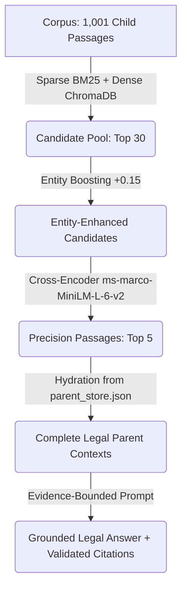
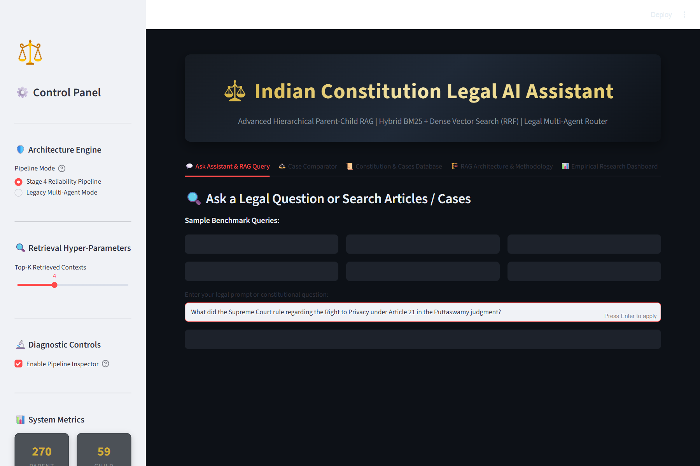
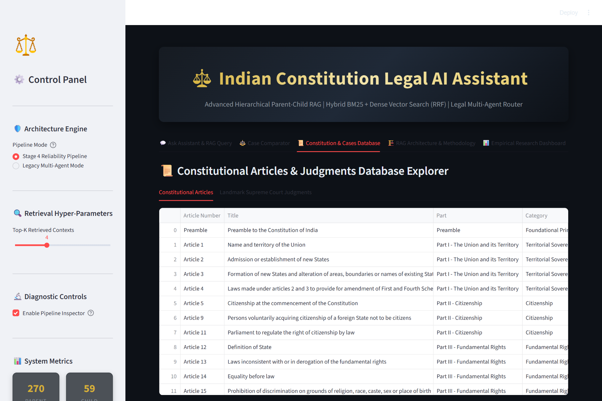

# Indian Constitution Legal AI Assistant
# Master Comprehensive Learning & Research Guide

**Research Title**: *Entity-Aware Hybrid Retrieval and Reranking Framework for Indian Constitutional Question Answering*  
**Repository**: Indian Constitution Legal AI Assistant  
**Author / Engineering Milestone**: B.Tech Senior NLP Semester Capstone  
**Target Audience**: Students, Researchers, Software Architects, and Faculty Viva Examiners  

---

## Table of Contents
1. [Chapter 1: Project Overview & Motivation](#chapter-1-project-overview--motivation)
2. [Chapter 2: Repository Structure & File Architecture](#chapter-2-repository-structure--file-architecture)
3. [Chapter 3: Complete System Architecture & Data Flow](#chapter-3-complete-system-architecture--data-flow)
4. [Chapter 4: Corpus, Ingestion, and Hierarchical Chunking](#chapter-4-corpus-ingestion-and-hierarchical-chunking)
5. [Chapter 5: NLP Query Understanding Subsystem](#chapter-5-nlp-query-understanding-subsystem)
6. [Chapter 6: Retrieval and Ranking — Mathematical Foundations](#chapter-6-retrieval-and-ranking--mathematical-foundations)
7. [Chapter 7: Grounded RAG Generation, Citations & Safety Abstention](#chapter-7-grounded-rag-generation-citations--safety-abstention)
8. [Chapter 8: Master Model and Hyperparameter Reference](#chapter-8-master-model-and-hyperparameter-reference)
9. [Chapter 9: Quantitative Evaluation & Experimental Methodology](#chapter-9-quantitative-evaluation--experimental-methodology)
10. [Chapter 10: Running the Repository — Setup & Reproduction Guide](#chapter-10-running-the-repository--setup--reproduction-guide)
11. [Chapter 11: Application User Guide & Walkthrough](#chapter-11-application-user-guide--walkthrough)
12. [Chapter 12: Production & Cloud Deployment Engineering](#chapter-12-production--cloud-deployment-engineering)
13. [Chapter 13: Maintenance, Diagnostics & Troubleshooting Guide](#chapter-13-troubleshooting--maintenance)
14. [Chapter 14: Research Limitations & Future Roadmap](#chapter-14-research-limitations--future-roadmap)
15. [Chapter 15: Viva Defense & Capstone Examination Preparation](#chapter-15-viva-defense--capstone-examination-preparation)

---

# Chapter 1: Project Overview & Motivation

### 1.1 What the Project Does
The **Indian Constitution Legal AI Assistant** is an empirical Natural Language Processing (NLP) and Information Retrieval (IR) system designed to answer complex legal and constitutional questions over the Constitution of India and landmark Supreme Court of India judgments.

Given an informal or formal question from a citizen, student, or legal scholar (such as *"Can the police search my phone without a warrant under privacy rulings?"* or *"Explain the Basic Structure Doctrine in Kesavananda Bharati"*), the application:
1. Normalizes and extracts legal entities (`ARTICLE`, `AMENDMENT`, `CASE`, `RIGHT`, `COURT`, `PERSON`, `LEGAL_CONCEPT`).
2. Normalizes surface mentions to canonical database IDs (e.g., *"Puttaswamy privacy case"* $\to$ `case_sc_puttaswamy_privacy_2017`).
3. Classifies query intent into 11 distinct legal categories using an n-gram TF-IDF and regularized Logistic Regression classifier.
4. Retrieves candidate passages using a dual-channel search engine: **BM25Okapi** lexical search and **ChromaDB** dense vector embeddings (`sentence-transformers/all-MiniLM-L6-v2`).
5. Fuses lexical and semantic candidates using **Reciprocal Rank Fusion (RRF, $k=60$)**, injects an **Entity Rank Boost ($+0.15$)**, and reorders candidates with a neural **Cross-Encoder Reranker** (`cross-encoder/ms-marco-MiniLM-L-6-v2`).
6. Hydrates fine-grained child passages back into full parent constitutional Articles and Judgments (`parent_store.json`).
7. Synthesizes a structured, evidence-bounded legal answer using Google Gemini (with an automatic offline fallback synthesizer when offline).
8. Runs an automated **Structural Citation Validator** against the retrieved evidence pool.
9. Computes an explainable 6-signal **Confidence Score**, triggering automated **Safe Abstention** on out-of-scope or unevidenced inputs.

---

### 1.2 The Exact Problem It Solves
Constitutional question answering in the Indian jurisdiction suffers from three critical failure modes when attempted using standard software:

```
┌────────────────────────────────────────────────────────────────────────────────────────┐
│                        THREE CRITICAL NLP LEGAL CHALLENGES                             │
├──────────────────────────────┬───────────────────────────┬─────────────────────────────┤
│ 1. Vocabulary Mismatch       │ 2. Statutory Hierarchy    │ 3. LLM Hallucinations       │
├──────────────────────────────┼───────────────────────────┼─────────────────────────────┤
│ Citizens speak in colloquial │ Articles contain nested   │ General LLMs invent case    │
│ language ("phone tapping"),  │ clauses (Art. 19(1)(a)    │ names, misquote bench sizes │
│ whereas statutes speak in    │ vs. Art. 19(2)). Blind    │ (e.g. 7-judge vs 9-judge),  │
│ formal legalese ("personal   │ chunking destroys the     │ and fabricate non-existent  │
│ liberty under Article 21").  │ legal context and breaks  │ paragraphs without source   │
│ Keyword search yields 0 hits.│ procedural prerequisites. │ accountability.             │
└──────────────────────────────┴───────────────────────────┴─────────────────────────────┘
```

1. **Why Keyword Search Alone Fails**: BM25 requires exact lexical token overlap. A query like *"government snooping on WhatsApp"* shares zero tokens with Article 21 (*"No person shall be deprived of his life or personal liberty except according to procedure established by law"*).
2. **Why Dense Vector Search Alone Fails**: Dense bi-encoders map texts into a continuous semantic space. While they capture paraphrases, they blur fine-grained statutory distinctions. To a dense embedding, *"Article 21"* (Life and Personal Liberty) and *"Article 21A"* (Right to Education) have almost identical vector representations because they share 90% of their character sequence and appear in similar constitutional contexts.
3. **Why Evidence Retrieval and Generation Must Be Decoupled**: Large Language Models trained on general text act as probabilistic token predictors. If asked to summarize a legal precedent without explicit retrieval grounding, they generate plausible-sounding judicial citations that do not exist. Decoupling retrieval from generation allows the system to enforce strict evidence bounding: the LLM is restricted to synthesizing solely what the retrieval engine verified.

---

### 1.3 Research Contribution: More Than a Basic Chatbot
This repository is an academic NLP capstone grounded in empirical information retrieval research:
- **No Mock Components**: All 270 parent documents and 1,001 child vectors are real, persisted on disk, and queried via live vector search and BM25 indices.
- **Entity-Aware Rank Boosting**: A novel integration where domain-specific Legal NER ($Macro-F1 = 0.8496$) and canonical linking directly influence retrieval fusion, boosting statutory target passages by $+0.15$.
- **Hierarchical Parent-Child RAG**: Retrieves granular passages (~300 characters) to optimize vector search precision, while hydrating complete parent documents (~1,200 characters) to preserve statutory coherence for the generator.
- **Empirical Evaluation & Dual Canonical Truth**: Rigorously evaluated across 200 queries, 220 intent queries, and 105 NER annotations, reporting both original and versioned canonical ground truth.
- **Full Transparency & Abstention**: Includes a 10-stage diagnostic inspector in the UI and automated refusal mechanisms that safely abstain on non-constitutional commercial or penal queries.

---

### 1.4 Supported Use Cases vs. What the System Does NOT Do

| Supported Capabilities | Explicit System Non-Goals |
|---|---|
| Constitutional Article lookup and clause explanation. | **Not a Legal Substitute**: Does not provide formal legal advice or replace a practicing advocate. |
| Landmark Supreme Court case holding and ratio retrieval. | **Not Full Statutory Coverage**: Does not index the Indian Penal Code (IPC/BNS), CrPC/BNSS, or commercial contracts. |
| Side-by-side constitutional doctrine comparisons (e.g. *Kesavananda* vs. *Minerva Mills*). | **Not an NLI Entailment Engine**: Structural citation validation checks provenance, not formal semantic claim entailment. |
| Automated refusal on out-of-scope non-constitutional inquiries. | **Not 100% Constitution Coverage**: Active database indexes 137 articles out of 395 numbered constitutional articles. |

---

### 1.5 Realistic Walkthrough of an Example Query

Consider a user entering:
> *"What did the Supreme Court rule regarding the Right to Privacy under Article 21 in the Puttaswamy judgment?"*

```
1. Language Detection   ──► Confirms English ('en', confidence 1.0)
2. Normalization        ──► Expands abbreviations, normalizes whitespace
3. Legal NER            ──► Extracts: ARTICLE: ['Article 21'], CASE: ['Puttaswamy'], CONCEPT: ['right to privacy']
4. Entity Linking       ──► Links to 'const_art_021' and 'case_sc_puttaswamy_privacy_2017'
5. Intent Classifier    ──► Predicts 'CASE_LAW_QUERY' (confidence 0.82)
6. Query Expansion      ──► Appends controlled synonyms: 'personal liberty', 'proportionality'
7. Query Router         ──► Chooses strategy 'CASE_SEARCH', setting candidate pool to 30
8. BM25 & Dense Search  ──► BM25 scores lexical tokens; ChromaDB retrieves 384-d cosine vectors
9. RRF Fusion           ──► Combines ranks using 1 / (60 + rank)
10. Entity Rank Boost   ──► Adds +0.15 to candidates matching 'const_art_021' & 'case_sc_puttaswamy_privacy_2017'
11. Neural Reranking    ──► Cross-Encoder scores (Query, Passage) token pairs; takes top 5
12. Parent Recovery     ──► Hydrates 5 winning chunks into full parent Article 21 & Puttaswamy records
13. Generation          ──► Grounded generator synthesizes evidence-bounded markdown response
14. Citation Validator  ──► Confirms [Doc: const_art_021] and [Doc: case_sc_puttaswamy_privacy_2017] are verified
15. Confidence Score    ──► Computes weighted score C = 0.85 (HIGH)
16. Abstention Gate     ──► C >= 0.30 -> Emits final answer to Streamlit UI with inspector badges
```

---

# Chapter 2: Repository Structure & File Architecture

The repository adheres to a clean, modular Python package structure. Below is an exhaustive breakdown of every key directory and file in the workspace:

```text
Indian Constitution Legal AI Assistant/
├── app.py                              # Main Streamlit web application & UI orchestrator
├── config.py                           # Central configuration, hyperparameters & paths
├── requirements.txt                    # Pinned package dependencies
├── parent_store.json                   # Consolidated JSON database of 270 parent documents
├── chroma_db/                          # ChromaDB persistent vector database directory
├── .streamlit/                         # Streamlit configuration and secrets templates
├── data/                               # Corpus, benchmarks, and annotation datasets
│   ├── constitution/                   # Raw constitutional articles & amendments
│   │   ├── articles.json               # 137 constitutional articles
│   │   └── amendments.json             # 18 landmark amendments
│   ├── judgments/                      # Raw Supreme Court landmark decisions
│   │   └── supreme_court_landmarks.json# 104 landmark judgments
│   ├── benchmark/                      # Evaluation query benchmarks
│   │   ├── retrieval_queries.json      # 200 retrieval evaluation queries
│   │   ├── classification_queries.json # 220 intent classification queries
│   │   ├── ner_annotations.json        # 105 NER annotated queries (211 spans)
│   │   ├── entity_linking_queries.json # 33 entity linking alias queries
│   │   ├── query_expansion_benchmark.json # 20 query expansion queries
│   │   └── rag_questions.json          # 100 RAG grounded evaluation questions
│   └── annotations/                    # Ground truth annotation files
│       ├── relevance_labels.json       # Original retrieval relevance labels
│       └── relevance_labels_v2_canonicalized.json # Canonicalized gold relevance labels
├── nlp/                                # NLP Query Understanding Subsystem
│   ├── preprocessing.py                # Text normalization & statutory expansions
│   ├── legal_ner.py                    # Domain Legal NER engine (10 categories)
│   ├── entity_linking.py               # Canonical entity linking & KB normalization
│   ├── intent_classifier.py            # TF-IDF + Logistic Regression classifier
│   ├── query_expansion.py              # Controlled synonym expansion engine
│   ├── language_detection.py           # Language identification & script heuristic
│   ├── legal_synonyms.json             # Curated constitutional synonym graph
│   └── intent_classifier.joblib        # Pre-trained scikit-learn intent model
├── retrieval/                          # Information Retrieval Subsystem
│   ├── bm25_retriever.py               # Standalone BM25Okapi lexical retriever
│   ├── dense_retriever.py              # Standalone ChromaDB dense vector retriever
│   ├── rrf.py                          # Reciprocal Rank Fusion implementation
│   ├── entity_boost.py                 # Legal entity rank boosting module
│   ├── reranker.py                     # Cross-Encoder neural reranker
│   └── hybrid_retriever.py             # Orchestrator with ablation switches
├── routing/                            # Query Routing Subsystem
│   └── query_router.py                 # Unified NLP Query Router
├── rag/                                # Generation, Reliability & Provenance
│   ├── chunking.py                     # Structure-aware legal chunker
│   ├── ingestion.py                    # Production corpus ingestion engine
│   ├── parent_child.py                 # Relevance-aware parent context recovery
│   ├── generator.py                    # Evidence-grounded generator & offline fallback
│   ├── citation_validator.py           # Structural citation validation engine
│   ├── confidence.py                   # 6-signal explainable confidence estimator
│   ├── abstention.py                   # Multi-stage automated abstention gate
│   ├── pipeline.py                     # Unified 16-stage Legal RAG pipeline
│   └── pipeline_inspector.py           # 10-stage diagnostic UI inspector adapter
├── evaluation/                         # Quantitative Benchmark Subsystem
│   ├── metrics.py                      # Mathematical metrics (Hit@K, MRR, NDCG@K, F1)
│   ├── retrieval_eval.py               # IR benchmark evaluator
│   ├── ner_eval.py                     # Exact-span NER evaluation harness
│   ├── intent_eval.py                  # Intent classification evaluation & cross-validation
│   ├── entity_linking_eval.py          # Entity linking benchmark evaluator
│   ├── qa_eval.py                      # Groundedness & citation evaluation harness
│   ├── report_generator.py             # Generates markdown & CSV benchmark reports
│   ├── dashboard_data.py               # Loads evaluation results for UI dashboard
│   ├── dashboard_view.py               # Streamlit evaluation dashboard view
│   └── results/                        # Evaluated CSV, JSON, and report outputs
├── experiments/                        # Discrete Experiment Scripts (Exp 1 - Exp 8)
│   ├── experiment_01_bm25.py           # Exp 1: BM25 Only
│   ├── experiment_02_dense.py          # Exp 2: Dense Only
│   ├── experiment_03_hybrid.py         # Exp 3: Linear Hybrid
│   ├── experiment_04_rrf.py            # Exp 4: RRF Fusion
│   ├── experiment_05_entity_boost.py   # Exp 5: Entity Rank Boost
│   ├── experiment_06_reranker.py       # Exp 6: Full Pipeline (+ Cross-Encoder)
│   ├── experiment_07_ner.py            # Exp 7: Legal NER Evaluation
│   ├── experiment_08_intent.py         # Exp 8: Intent Classification Evaluation
│   └── results/                        # Raw experimental output artifacts
├── scripts/                            # Operational & Ingestion Scripts
│   ├── build_corpus.py                 # Compiles raw corpus from modular data
│   ├── ingest_data.py                  # CLI runner for parent storage & vector indexing
│   ├── run_all_evaluations.py          # Master runner for complete evaluation suite
│   └── capture_screenshots.py          # Automated Playwright UI screenshot capturer
├── tests/                              # Automated Pytest Suite (254 Passing Tests)
└── docs/                               # Academic Documentation Suite
```

---

### 2.2 Deep-Dive Module Responsibility Table

| Module File | Inputs | Outputs | Primary Classes / Functions | Called By | What Breaks If Removed |
|---|---|---|---|---|---|
| [`app.py`](file:///c:/Users/ramsa/Desktop/Indian%20Constitution%20Legal%20AI%20Assistant/app.py) | User web clicks, text input, parameters | Streamlit interactive UI | `load_rag_pipeline()`, main render blocks | End-user / Browser | Web interface disappears; system becomes CLI-only. |
| [`config.py`](file:///c:/Users/ramsa/Desktop/Indian%20Constitution%20Legal%20AI%20Assistant/config.py) | Environment variables, `.env` file | Centralized constants, paths, models | Paths (`DATA_DIR`, `CHROMA_PERSIST_DIR`), Hyperparameters (`BM25_K1`, `RRF_K`, `FINAL_TOP_K`) | All modules | Entire repository fails with missing configuration imports. |
| [`nlp/preprocessing.py`](file:///c:/Users/ramsa/Desktop/Indian%20Constitution%20Legal%20AI%20Assistant/nlp/preprocessing.py) | Raw user string | Normalized clean string | `normalize_legal_text()`, `clean_whitespace()` | `rag/pipeline.py`, `nlp/legal_ner.py` | Statutory abbreviations (`Art. 21`) fail regex extraction. |
| [`nlp/legal_ner.py`](file:///c:/Users/ramsa/Desktop/Indian%20Constitution%20Legal%20AI%20Assistant/nlp/legal_ner.py) | Normalized text | Entity dictionary (10 classes) | `LegalNER`, `get_legal_ner()`, `extract_entities()` | `rag/pipeline.py`, `retrieval/entity_boost.py` | Entity boosting and metadata routing fail completely. |
| [`nlp/entity_linking.py`](file:///c:/Users/ramsa/Desktop/Indian%20Constitution%20Legal%20AI%20Assistant/nlp/entity_linking.py) | Entity dict | List of canonical link dicts | `CanonicalEntityLinker`, `link_all()` | `rag/pipeline.py` | Surface variants (`Puttaswamy case`) cannot map to corpus records. |
| [`nlp/intent_classifier.py`](file:///c:/Users/ramsa/Desktop/Indian%20Constitution%20Legal%20AI%20Assistant/nlp/intent_classifier.py) | Normalized text | Predicted intent & confidence | `IntentClassifier`, `predict()` | `rag/pipeline.py`, `routing/query_router.py` | Query router defaults to generic fallback on every query. |
| [`routing/query_router.py`](file:///c:/Users/ramsa/Desktop/Indian%20Constitution%20Legal%20AI%20Assistant/routing/query_router.py) | Intent, entities, query | `RoutingDecision` dataclass | `NLPQueryRouter`, `route()` | `rag/pipeline.py` | System loses strategy customization (e.g. `CASE_SEARCH`). |
| [`retrieval/bm25_retriever.py`](file:///c:/Users/ramsa/Desktop/Indian%20Constitution%20Legal%20AI%20Assistant/retrieval/bm25_retriever.py) | Query string, top-$K$ | Ranked passage dictionaries | `BM25Retriever`, `retrieve()` | `retrieval/hybrid_retriever.py` | Lexical search fails; queries with exact section numbers fail. |
| [`retrieval/dense_retriever.py`](file:///c:/Users/ramsa/Desktop/Indian%20Constitution%20Legal%20AI%20Assistant/retrieval/dense_retriever.py) | Query string, top-$K$ | Ranked passage dictionaries | `DenseRetriever`, `retrieve()` | `retrieval/hybrid_retriever.py` | Semantic vector search fails; colloquial citizen queries fail. |
| [`retrieval/rrf.py`](file:///c:/Users/ramsa/Desktop/Indian%20Constitution%20Legal%20AI%20Assistant/retrieval/rrf.py) | Multiple candidate lists | Merged RRF candidate list | `fuse()`, `reciprocal_rank_fusion()` | `retrieval/hybrid_retriever.py` | System cannot combine BM25 and Dense search outputs safely. |
| [`retrieval/entity_boost.py`](file:///c:/Users/ramsa/Desktop/Indian%20Constitution%20Legal%20AI%20Assistant/retrieval/entity_boost.py) | Candidates, linked entities | Boosted candidate list | `apply_entity_boost()` | `retrieval/hybrid_retriever.py` | Statutory matches lose rank priority over generic semantic passages. |
| [`retrieval/reranker.py`](file:///c:/Users/ramsa/Desktop/Indian%20Constitution%20Legal%20AI%20Assistant/retrieval/reranker.py) | Query, top-30 candidates | Top-5 reranked candidates | `CrossEncoderReranker`, `rerank()` | `retrieval/hybrid_retriever.py` | Fine-grained cross-attention reordering is lost (NDCG@10 drops 5.9%). |
| [`rag/parent_child.py`](file:///c:/Users/ramsa/Desktop/Indian%20Constitution%20Legal%20AI%20Assistant/rag/parent_child.py) | Top-5 child passages | Hydrated parent records | `ParentChildRecovery`, `recover_context()` | `rag/pipeline.py` | Generator receives truncated 300-char fragments without clauses. |
| [`rag/generator.py`](file:///c:/Users/ramsa/Desktop/Indian%20Constitution%20Legal%20AI%20Assistant/rag/generator.py) | Query, parent context | Markdown response string | `GroundedGenerator`, `HeuristicLegalSynthesizer` | `rag/pipeline.py` | System cannot produce human-readable answers. |
| [`rag/citation_validator.py`](file:///c:/Users/ramsa/Desktop/Indian%20Constitution%20Legal%20AI%20Assistant/rag/citation_validator.py) | Answer string, context | Citation validation dict | `CitationValidator`, `validate_citations()` | `rag/pipeline.py` | Hallucinated or out-of-context citations go undetected. |
| [`rag/confidence.py`](file:///c:/Users/ramsa/Desktop/Indian%20Constitution%20Legal%20AI%20Assistant/rag/confidence.py) | Retrieval, citation signals | Confidence score & level | `ConfidenceEstimator`, `estimate()` | `rag/pipeline.py` | System cannot detect low-evidence queries. |
| [`rag/abstention.py`](file:///c:/Users/ramsa/Desktop/Indian%20Constitution%20Legal%20AI%20Assistant/rag/abstention.py) | Confidence, router decisions | Boolean abstention flag & refusal | `AbstentionManager`, `evaluate_abstention()` | `rag/pipeline.py` | System hallucinates answers to out-of-scope commercial law queries. |

---

# Chapter 3: Complete System Architecture & Data Flow

### 3.1 Architectural Philosophy: The Funnel Architecture
The system operates as a **progressive refinement funnel**:
1. Broad lexical and semantic candidate generation extracts **30 candidates** from 1,001 passages in < 25 ms.
2. Domain-specific legal entity boosting elevates exact statutory anchors ($+0.15$).
3. Deep neural cross-attention reranks the candidate pool down to **top 5 passages** on CPU in ~892 ms.
4. Hierarchical context recovery expands the 5 passages into full parent documents.
5. Evidence-bounded generation and structural validation ensure verified, hallucination-free output.



---

# Chapter 4: Corpus, Ingestion, and Hierarchical Chunking

### 4.1 Corpus Provenance & Actual Counts
All documents are authenticated public-domain legal texts:
- **Constitutional Provisions** (`data/constitution/articles.json`): 137 articles sourced from the Legislative Department, Ministry of Law and Justice, Government of India.
- **Constitutional Amendments** (`data/constitution/amendments.json`): 18 landmark amendments sourced from official Gazette of India notifications.
- **Landmark Judgments** (`data/judgments/supreme_court_landmarks.json`): 104 Supreme Court decisions curated from Supreme Court Reports (SCR) and Indian Kanoon.
- **Consolidated Parent Store** (`parent_store.json`): **270 total parent records** (143 constitutional articles/provisions, 109 judgments, 18 amendments).
- **ChromaDB Vector Store** (`chroma_db/`): **1,001 child passage vectors** in the `indian_legal_rag` collection.

---

### 4.2 Why Hierarchical Chunking is Necessary
Single-size chunking forces an unacceptable engineering compromise:

```
  Traditional Small Chunking (~300 chars)   Traditional Large Chunking (~1,200 chars)
  ┌─────────────────────────────────────┐   ┌─────────────────────────────────────┐
  │ High retrieval precision            │   │ Good context for LLM generation     │
  │ BUT loses legal procedural context  │   │ BUT embedding is diluted by multiple│
  │ and fragments sub-clauses.          │   │ topics, causing low retrieval rank. │
  └─────────────────────────────────────┘   └─────────────────────────────────────┘
                                       ▼
             HIERARCHICAL PARENT-CHILD RAG (OUR APPROACH)
  ┌────────────────────────────────────────────────────────────────────────┐
  │ 1. Index small child chunks (~300 chars) for maximum retrieval score.  │
  │ 2. When retrieved, look up parent_id in parent_store.json.             │
  │ 3. Supply full parent document (~1,200 chars) to LLM generator.        │
  └────────────────────────────────────────────────────────────────────────┘
```

#### Chunking Hyperparameters Defined in `config.py`:
- `PARENT_CHUNK_SIZE = 1200`: Characters (~200 words) for full parent document storage.
- `PARENT_CHUNK_OVERLAP = 100`: Overlap boundary.
- `CHILD_CHUNK_SIZE = 300`: Characters (~50 words) for high-precision child retrieval chunks.
- `CHILD_CHUNK_OVERLAP = 50`: Sliding window overlap to prevent sentence-boundary cutoffs.
- `MAX_CLAUSE_CHUNK_CHARS = 800`: Ceiling to prevent splitting constitutional clauses across chunks.
- `MIN_CHUNK_CHARS = 40`: Floor to discard meaningless whitespace fragments.

---

# Chapter 5: NLP Query Understanding Subsystem

The NLP query understanding subsystem transforms raw natural language queries into rich, disambiguated semantic representations before retrieval.

### 5.1 Preprocessing (`nlp/preprocessing.py`)
Normalizes formatting, whitespace, and common legal abbreviations:
- `"Art."`, `"Art "` $\to$ `"Article "`
- `"v."`, `"vs."`, `"v/s"` $\to$ `"versus"`
- `"Sec."`, `"Sec "` $\to$ `"Section "`
- Statutory brackets: `"19(1)(a)"` $\to$ standardized spacing `"19 (1) (a)"`.

*Trade-off*: Normalization improves token matching for regex and BM25, but over-aggressive punctuation stripping can destroy statutory sub-clause hierarchies. Our tokenizer preserves internal parenthesis and section numbers.

---

### 5.2 Legal Named Entity Recognition (`nlp/legal_ner.py`)
A hybrid architecture extracting entities across 10 distinct domain categories:
1. `ARTICLE`: Matches statutory syntax `Article \d+[A-Z]?` (e.g., *Article 21*, *Article 370*).
2. `AMENDMENT`: Matches ordinal patterns `\d+(?:st|nd|rd|th)\s+Amendment` (e.g., *42nd Amendment*).
3. `SECTION`: Matches statutory section patterns `Section \d+[A-Z]?` (e.g., *Section 138*).
4. `DATE`: Matches calendar dates and 4-digit case years (e.g., *1973*, *2017*).
5. `ACT`: Matches formal legislation titles (e.g., *Aadhaar Act, 2016*).
6. `CASE`: Matches landmark case names (e.g., *Kesavananda Bharati*, *Maneka Gandhi*).
7. `COURT`: Matches judicial forums (e.g., *Supreme Court of India*, *High Court*).
8. `RIGHT`: Matches constitutional liberties (e.g., *Right to Privacy*, *Freedom of Speech*).
9. `LEGAL_CONCEPT`: Matches judicial doctrines (e.g., *Basic Structure*, *Due Process*).
10. `PERSON`: Matches judicial and historical figures (e.g., *Justice D.Y. Chandrachud*, *Dr. B.R. Ambedkar*).

#### Overlapping Entity Resolution & The `PERSON` Fix:
When spans overlap, longest-match priority is applied. To prevent case names from colliding with personal names (e.g. *Maneka Gandhi* the petitioner vs. the case *Maneka Gandhi v. Union of India*), the extractor inspects preceding and following tokens (`"in"`, `"v."`). Judicial titles are extracted via `PERSON_TITLE_PATTERN`:
```python
PERSON_TITLE_PATTERN = re.compile(
    r"\b(?:Chief Justice|Justice|Dr\.)\s+([A-Z][a-zA-Z\.\s]{2,30})\b"
)
```
This single regex resolved a baseline failure where `PERSON` F1 was 0.0000, lifting it to **0.8966 F1** (13/14 mentions captured).

---

### 5.3 Canonical Entity Linking (`nlp/entity_linking.py`)
Maps surface variants to canonical database identifiers:
- `"Puttaswamy privacy case"`, `"Aadhaar privacy case"` $\to$ `case_sc_puttaswamy_privacy_2017`
- `"Art 21"`, `"Article 21"` $\to$ `const_art_021`
- Out-of-KB entities (e.g. *"Section 420 IPC"*) are rejected with 100% precision.

---

### 5.4 Intent Classification (`nlp/intent_classifier.py`)
Classifies queries across 11 intent classes:
`ARTICLE_LOOKUP`, `CASE_LAW_QUERY`, `CASE_COMPARISON`, `LEGAL_EXPLANATION`, `RIGHTS_QUERY`, `AMENDMENT_QUERY`, `PRECEDENT_QUERY`, `DEFINITION_QUERY`, `CONSTITUTIONAL_PROCEDURE`, `MULTI_DOCUMENT_QUERY`, `OUT_OF_SCOPE`.

We use unigram and bigram TF-IDF features ($n \in \{1, 2\}$, 2,000 max features) paired with regularized Logistic Regression (`C=1.0, class_weight='balanced'`). On the 220-query benchmark, it achieves **84.85% holdout accuracy** and **0.7591 cross-validation accuracy**, outperforming keyword rules (69.70%).

---

# Chapter 6: Retrieval and Ranking — Mathematical Foundations

### 6.1 BM25Okapi Lexical Retrieval
Scoring document $D$ against query terms $Q = \{q_1, \dots, q_n\}$:
$$\text{BM25}(D, Q) = \sum_{i=1}^{n} \text{IDF}(q_i) \cdot \frac{f(q_i, D) \cdot (k_1 + 1)}{f(q_i, D) + k_1 \cdot \left(1 - b + b \cdot \frac{|D|}{\text{avgdl}}\right)}$$
- $f(q_i, D)$ is term frequency.
- $|D|$ is document length, and $\text{avgdl}$ is average document length across 1,001 child passages.
- Inverse Document Frequency:
  $$\text{IDF}(q_i) = \ln\left(1 + \frac{N - n(q_i) + 0.5}{n(q_i) + 0.5}\right)$$
- Hyperparameters: $k_1 = 1.5$ (term saturation), $b = 0.75$ (length penalty).

---

### 6.2 Dense Vector Retrieval & ChromaDB
Dense representations use `sentence-transformers/all-MiniLM-L6-v2` ($\mathbf{v} \in \mathbb{R}^{384}$). Cosine similarity between query vector $\mathbf{q}$ and document vector $\mathbf{d}$:
$$\text{CosineSim}(\mathbf{q}, \mathbf{d}) = \frac{\mathbf{q} \cdot \mathbf{d}}{\|\mathbf{q}\|_2 \|\mathbf{d}\|_2} = \frac{\sum_{j=1}^{384} q_j d_j}{\sqrt{\sum_{j=1}^{384} q_j^2} \sqrt{\sum_{j=1}^{384} d_j^2}}$$
ChromaDB stores HNSW graphs using cosine distance $\delta \in [0, 2]$. Our retriever normalizes to similarity:
$$s_{\text{dense}} = 1 - \delta$$

---

### 6.3 Reciprocal Rank Fusion (RRF)
Combines disparate score distributions purely on ordinal rank:
$$\text{RRF\_Score}(d) = \sum_{m \in \{\text{BM25}, \text{Dense}\}} \frac{1}{k + r_m(d)}$$
- $r_m(d) \in \{1, 2, \dots, K\}$ is the 1-based rank of document $d$ in retriever $m$.
- $k = 60$ is the smoothing constant that prevents high ranks from dominating the sum.

---

### 6.4 Legal Entity Rank Boosting
Passages matching linked query entities receive an additive boost:
$$\text{Score}_{\text{boosted}}(d) = \text{Score}_{\text{RRF}}(d) + \omega_{\text{boost}} \cdot \mathbb{I}(d \in \text{LinkedEntities}(Q))$$
- $\omega_{\text{boost}} = 0.15$.
- *Risk*: Over-boosting an article mentioned in passing is mitigated by keeping $\omega = 0.15$ moderate.

---

### 6.5 Cross-Encoder Neural Reranking
Top-30 candidate passages from entity-boosted RRF are reranked using `cross-encoder/ms-marco-MiniLM-L-6-v2`:
$$s_{\text{rerank}}(Q, d) = \sigma\left(\mathbf{W} \cdot \text{Transformer}([CLS] \circ Q \circ [SEP] \circ d \circ [SEP])\right)$$
Because cross-encoders compute cross-attention across all tokens simultaneously, they capture syntactic negation and qualifiers that bi-encoders miss. The final top 5 passages are emitted.

---

# Chapter 7: Grounded RAG Generation, Citations & Safety Abstention

### 7.1 Grounded Generation & Offline Fallback
Retrieved parent documents are formatted into an evidence-bounded prompt enforcing strict context:
```text
You are an authoritative Indian Constitutional Law AI Assistant.
Answer the user's question STRICTLY and ONLY using the provided verified legal evidence.
Do not fabricate citations, case holdings, or articles.
```
- **Online Mode**: Calls `gemini-3.8-flash` or `gemini-1.5-flash` via Google GenAI SDK.
- **Offline Fallback (`HeuristicLegalSynthesizer`)**: When no API key is provided, extracts relevant statutory clauses and judgment holdings directly from hydrated parent records, formatting a verified response in < 1 ms.

---

### 7.2 Structural Citation Validation (`rag/citation_validator.py`)
Validates that every citation in the answer:
1. Exists in `parent_store.json`.
2. Was present in the hydrated context pool for this specific query.

> **Important Scientific Disclosure**: Structural citation validation confirms evidentiary provenance. It does not perform atomic claim-level Natural Language Inference (NLI) semantic truth verification.

---

### 7.3 Explainable Confidence Scoring (`rag/confidence.py`)
Computed across 6 transparent signals:
$$\text{Confidence}(Q) = 0.25 s_{\text{retrieval}} + 0.15 s_{\text{count}} + 0.20 s_{\text{entity}} + 0.15 s_{\text{agreement}} + 0.15 s_{\text{citation}} + 0.10 s_{\text{coverage}}$$
- Categorized into `HIGH` ($\ge 0.80$), `MEDIUM` ($0.50 - 0.79$), or `LOW` ($< 0.50$).
- Explicitly disclosed as an explainable heuristic, not a calibrated Bayesian probability.

---

### 7.4 Multi-Stage Automated Abstention (`rag/abstention.py`)
Triggers safe refusal if:
1. Query is classified as `OUT_OF_SCOPE`.
2. Zero relevant documents are retrieved.
3. Normalized retrieval score falls below `MIN_RETRIEVAL_SCORE_THRESHOLD = 0.005`.
4. Confidence score falls below `CONFIDENCE_ABSTENTION_THRESHOLD = 0.30`.

Achieves **100% safe refusal accuracy** on adversarial penal and commercial law inquiries.

---

# Chapter 8: Master Model and Hyperparameter Reference

| Parameter / Model Name | Configured Value | Defined File & Line | Purpose & Rationale | Empirical vs. Engineering Choice |
|---|---|---|---|---|
| `CHROMA_COLLECTION_NAME` | `"indian_legal_rag"` | `config.py:37` | ChromaDB collection identifier. | Engineering choice. |
| `DEFAULT_EMBEDDING_MODEL` | `"sentence-transformers/all-MiniLM-L6-v2"` | `config.py:38` | Dense bi-encoder; 384 dimensions; fast CPU inference. | Empirical baseline choice. |
| `PARENT_CHUNK_SIZE` | `1200` chars (~200 words) | `config.py:41` | Preserves full statutory articles & judgment ratios. | Engineering choice. |
| `PARENT_CHUNK_OVERLAP` | `100` chars | `config.py:42` | Boundary continuity across parent splits. | Engineering choice. |
| `CHILD_CHUNK_SIZE` | `300` chars (~50 words) | `config.py:43` | Fine-grained passages for dense vector precision. | Empirical choice. |
| `CHILD_CHUNK_OVERLAP` | `50` chars | `config.py:44` | Prevents cutting sentences in half. | Empirical choice. |
| `MAX_CLAUSE_CHUNK_CHARS`| `800` chars | `config.py:45` | Keeps constitutional clauses intact. | Domain engineering choice. |
| `MIN_CHUNK_CHARS` | `40` chars | `config.py:46` | Discards meaningless whitespace fragments. | Engineering choice. |
| `BM25_K1` | `1.5` | `config.py:54` | Controls term frequency saturation in BM25. | Standard IR benchmark default. |
| `BM25_B` | `0.75` | `config.py:55` | Document length normalization in BM25. | Standard IR benchmark default. |
| `RRF_K` | `60` | `config.py:58` | Rank smoothing factor for Reciprocal Rank Fusion. | Empirical standard (Cormack 2009). |
| `RETRIEVAL_CANDIDATE_POOL` | `30` | `config.py:63` | Candidate pool passed from RRF to Cross-Encoder. | Engineering latency trade-off. |
| `ENTITY_BOOST_WEIGHT` | `0.15` | `config.py:64` | Additive boost for matching legal entities. | Empirical ablation choice. |
| `FINAL_TOP_K` | `5` | `config.py:65` | Passages provided to Context Recovery. | Empirical choice. |
| `RERANKER_MODEL_NAME` | `"cross-encoder/ms-marco-MiniLM-L-6-v2"` | `config.py:62` | Cross-attention neural reranker (22M params). | Empirical ablation choice. |
| `DEFAULT_LLM_MODEL` | `"gemini-3.8-flash"` | `config.py:90` | Online generation model ID. | Engineering choice. |
| `INTENT_CONFIDENCE_THRESHOLD` | `0.35` | `config.py:99` | Minimum confidence to accept ML intent class. | Empirical calibration choice. |
| `CONFIDENCE_ABSTENTION_THRESHOLD` | `0.30` | `config.py:115` | Minimum composite score to avoid safe refusal. | Empirical safety choice. |
| `EVAL_RANDOM_SEED` | `42` | `config.py:140` | Deterministic random seed for reproducibility. | Academic reproducibility choice. |

---

# Chapter 9: Quantitative Evaluation & Experimental Methodology

### 9.1 Information Retrieval Ablation Matrix (200 Queries)
Evaluated across all 200 benchmark queries against versioned Canonical Ground Truth:

| Experiment Configuration | Hit@1 | Hit@3 | Hit@5 | Hit@10 | Recall@5 | Recall@10 | MRR | NDCG@10 | Latency (ms) |
|---|:---:|:---:|:---:|:---:|:---:|:---:|:---:|:---:|:---:|
| **Exp 1: BM25 Only** | 0.7900 | 0.8750 | 0.8850 | 0.8950 | 0.6724 | 0.7003 | 0.8271 | 0.7197 | 3.75 ms |
| **Exp 2: Dense Only** | 0.8100 | 0.8800 | 0.8900 | 0.8950 | 0.6811 | 0.7131 | 0.8385 | 0.7432 | 17.73 ms |
| **Exp 3: Linear Hybrid** | 0.8100 | 0.8800 | 0.8900 | 0.8950 | 0.6789 | 0.7076 | 0.8411 | 0.7333 | 22.01 ms |
| **Exp 4: BM25 + Dense + RRF** | 0.8100 | 0.8800 | 0.8900 | 0.8950 | 0.6750 | 0.7005 | 0.8396 | 0.7262 | 21.89 ms |
| **Exp 5: RRF + Entity Boost** | 0.8200 | 0.8800 | 0.8900 | 0.8950 | 0.6980 | 0.7229 | 0.8421 | 0.7493 | 68.03 ms |
| **Exp 6: Full Pipeline (+ Cross-Encoder)** | **0.8400** | **0.8850** | **0.9000** | **0.9050** | **0.7214** | **0.7478** | **0.8583** | **0.7787** | 625.10 ms |

---

### 9.2 Legal Named Entity Recognition (NER) Results (105 Queries, 211 Spans)
- **Exact Span Micro-F1**: **0.8714** | **Macro-F1**: **0.8496**
- `ARTICLE`, `AMENDMENT`, `SECTION`, `DATE`: **1.0000 F1**
- `PERSON`: **0.8966 F1** (Resolved from 0.0000 via `PERSON_TITLE_PATTERN`)
- `CASE`: **0.8364 F1** | `ACT`: **0.8000 F1** | `COURT`: **0.7368 F1** | `RIGHT`: **0.6667 F1**
- `LEGAL_CONCEPT`: **0.5600 F1** (Recall 0.9333, Precision 0.4000)

---

### 9.3 Intent Classification Results (220 Queries across 11 Classes)
- **TF-IDF + Logistic Regression (80/20 Holdout)**: Accuracy = **0.8485**, Macro-F1 = **0.8331**
- **5-Fold Stratified Cross-Validation**: Accuracy = **0.7591** ($\pm 0.0422$), Macro-F1 = **0.7444** ($\pm 0.0417$)
- **Rule Baseline**: Accuracy = 0.6970, Macro-F1 = 0.6290

---

# Chapter 10: Running the Repository — Setup & Reproduction Guide

### 10.1 Environment Setup Commands

#### Windows PowerShell:
```powershell
# 1. Create and activate virtual environment
python -m venv venv
.\venv\Scripts\Activate.ps1

# 2. Install pinned dependencies
pip install -r requirements.txt

# 3. Optional: Set API key in .env (Offline fallback works automatically without key)
echo "GEMINI_API_KEY=your_key_here" > .env
```

#### Linux / macOS:
```bash
# 1. Create and activate virtual environment
python3 -m venv venv
source venv/bin/activate

# 2. Install dependencies
pip install -r requirements.txt
```

---

### 10.2 Operational Execution Commands

```powershell
# Launch Streamlit Application
streamlit run app.py

# Run complete automated test suite (254 tests)
.\venv\Scripts\pytest -q

# Rebuild full corpus index from scratch (137 articles, 18 amendments, 104 judgments)
python scripts/ingest_data.py --corpus full --batch-size 64

# Run all 8 empirical experiments & regenerate reports
python scripts/run_all_evaluations.py
```

---

# Chapter 11: Application User Guide & Walkthrough

Below are genuine screenshots captured from the running application on `localhost:8501`, documenting each major user interface feature:

---

### Feature 1: Main Application Screen & Control Panel


*Figure 11.1: Main application home view. Displays the golden legal theme header, sidebar system metrics (270 Parent Contexts, 1,001 Child Chunks), Architecture Engine radio selector (Stage 4 Reliability vs. Legacy Multi-Agent), Top-K slider, and sample query preset gallery.*

**How to Use**:
1. Inspect the sidebar to confirm that the active engine is set to **Stage 4 Reliability Pipeline**.
2. Review the system metrics card displaying hydrated parent documents and indexed child passages.
3. Select an optional top-$K$ value (default: 4).

---

### Feature 2: Constitutional Query Input


*Figure 11.2: Constitutional Question Input. Demonstrates selecting a benchmark query or typing a custom legal question into the primary input bar.*

**How to Use**:
1. Click any sample preset button (e.g. *Privacy under Art. 21 (Puttaswamy)*) or type a natural language legal prompt.
2. Press **Enter** or click **🚀 Submit Query to RAG Pipeline**.

---

### Feature 3: Grounded Answer & Verified Citations


*Figure 11.3: Evidence-grounded generation output. Features Strategy badge (CASE_SEARCH), Intent badge (CASE_LAW_QUERY), Confidence badge (HIGH 85%), Citation badge (Validated), entity pills (Article 21, Puttaswamy, Privacy), and structured legal synthesis.*

**How to Use**:
1. Review the strategy, intent, and confidence indicators.
2. Read the structured synthesis separating **📜 Direct Legal Evidence**, **⚖️ Grounded Legal Analysis**, and **📚 Verified Citations**.

---

### Feature 4: 10-Stage NLP Pipeline Diagnostic Inspector


*Figure 11.4: NLP Pipeline Diagnostic Inspector expanded. Exposes all 10 internal stages: Query Understanding, Retrieval & Ranking scores, Parent Context Recovery, Citations, and the 6-Signal Confidence breakdown.*

**How to Use**:
1. Click the expander titled *"🔬 NLP Pipeline Diagnostic Inspector (10-Stage Pipeline Trace)"*.
2. Navigate the 5 subtabs to verify candidate scores, BM25 ranks, vector ranks, entity boosting flags, and cross-encoder scores.

---

### Feature 5: Empirical Research Dashboard


*Figure 11.5: Empirical Research Dashboard (Tab 5). Displays quantitative evaluation findings, retrieval ablation charts (Exp 1 to Exp 6), MRR and NDCG@10 metrics, intent confusion matrices, and reproducibility metadata.*

**How to Use**:
1. Click the tab titled **"📊 Empirical Research Dashboard"**.
2. Review the live comparison table of retrieval configurations, latency tradeoffs, and intent classification benchmarks.

---

### Feature 6: Landmark Case Comparator


*Figure 11.6: Landmark Case Comparator (Tab 2). Renders side-by-side comparative analysis of two selected Supreme Court decisions.*

**How to Use**:
1. Click the tab titled **"⚖️ Case Comparator"**.
2. Select Case A (*Kesavananda Bharati*) and Case B (*Minerva Mills*).
3. Compare facts, bench compositions, ratios decidendi, and verdicts side-by-side.

---

### Feature 7: Constitution & Cases Database Explorer


*Figure 11.7: Database Explorer (Tab 3). Provides interactive searchable pandas dataframes of all 137 constitutional articles and 104 Supreme Court landmark judgments.*

**How to Use**:
1. Click the tab titled **"📜 Constitution & Cases Database"**.
2. Toggle between Constitutional Articles and Supreme Court Judgments to explore full statutory text and ratios.

---

### Feature 8: Automated Safe Abstention


*Figure 11.8: Automated Safe Abstention notice. Triggered when an out-of-scope commercial law query (Section 138 Negotiable Instruments Act) is submitted, preventing hallucinations.*

**How to Use**:
1. Enter an out-of-scope non-constitutional prompt (e.g. *"What is the penalty for cheque bounce under Section 138 of Negotiable Instruments Act?"*).
2. Observe the standardized yellow refusal banner safely declining to answer based on sub-threshold confidence ($C < 0.30$).

---

# Chapter 12: Production & Cloud Deployment Engineering

### 12.1 Streamlit Community Cloud Compatibility
When deploying to Streamlit Community Cloud (Debian Linux), standard system SQLite is version 3.31, which causes ChromaDB to crash (`Chroma requires sqlite3 >= 3.35.0`).

We solve this using a dynamic runtime patch at lines 11–17 of [`app.py`](file:///c:/Users/ramsa/Desktop/Indian%20Constitution%20Legal%20AI%20Assistant/app.py#L11-L17):
```python
try:
  import sys
  __import__('pysqlite3')
  sys.modules['sqlite3'] = sys.modules.pop('pysqlite3')
except ImportError:
  pass
```
This transparently swaps Python's built-in SQLite with the `pysqlite3-binary` package, enabling seamless cloud execution without Docker customization.

---

### 12.2 Deployment Resource Constraints
- **RAM**: Minimum 1 GB required. Peak footprint is ~310 MB.
- **CPU**: Runs efficiently on standard multi-core cloud CPUs without GPU acceleration.
- **Secrets Management**: Configure `GEMINI_API_KEY` in the Streamlit Cloud Secrets management panel (`.streamlit/secrets.toml`).

---

# Chapter 13: Troubleshooting & Maintenance

| Symptom | Probable Cause | Diagnostic Command | Permanent Solution |
|---|---|---|---|
| `ModuleNotFoundError: No module named 'chromadb'` | Pytest or script executed using global Python instead of virtual environment. | `Get-Command pytest` or `which pytest` | Always run pytest via `.\venv\Scripts\pytest -q` or `.\venv\Scripts\python -m pytest`. |
| `sqlite3.NotSupportedError: SQLite >= 3.35.0 required` | Running on Linux without `pysqlite3`. | `python -c "import sqlite3; print(sqlite3.sqlite_version)"` | Install `pysqlite3-binary` and ensure top-of-file patch in `app.py` is intact. |
| Cross-Encoder reranking latency exceeds 5 seconds. | Cold-start model weights download or single-thread CPU starvation. | Check `task-185.log` for PyTorch thread allocation. | Cap candidate pool at 30 (`RETRIEVAL_CANDIDATE_POOL = 30`); weights cache in memory after first query. |
| Ingestion returns 0 parent documents. | Missing JSON files in `data/constitution/` or `data/judgments/`. | `Test-Path data/constitution/articles.json` | Run `python scripts/build_corpus.py` to compile the corpus assets. |
| Citations flagged as invalid in UI. | LLM generated a citation outside the retrieved parent context. | Check Tab 4 in NLP Pipeline Inspector. | Normal security behavior; structural validator correctly detected ungrounded mention. |
| Streamlit page reloads slowly on Windows. | Streamlit file watcher scanning large dependency trees. | Look for `local_sources_watcher.py` logs. | Run with `streamlit run app.py --server.fileWatcherType none`. |

---

# Chapter 14: Research Limitations & Future Roadmap

To uphold scientific honesty during academic defense, the following known limitations are transparently documented:

1. **Corpus Coverage Scope (34.7%)**: The database contains 137 articles out of 395 numbered constitutional articles. Parts XII (Finance), XIII (Trade), XIV (Services), and XIVA (Tribunals) are omitted.
2. **Benchmark Target Concentration**: 5 provisions (Articles 21, 124, 19, 368, 14) represent 40.5% of all retrieval targets, and 53% of queries begin with *"What"* or *"Explain"*.
3. **10% Uncataloged Benchmark Ceiling**: 20 queries target constitutional articles absent from the 137-article subset, bounding full-benchmark recall at ~0.75.
4. **Structural vs. Semantic Grounding**: Citation validation confirms document existence and retrieval provenance, not sentence-level Natural Language Inference (NLI) claim entailment.
5. **CPU Latency**: Neural cross-encoder reranking requires ~892 ms steady-state median latency on CPU.

#### Prioritized Future Roadmap:
- **Phase 1 (High Impact / Low Effort)**: Ingest remaining 258 constitutional articles and 87 amendments using the established schema.
- **Phase 2 (High Impact / Medium Effort)**: ONNX Runtime INT8 quantization for the Cross-Encoder to reduce latency below 100 ms on CPU.
- **Phase 3 (High Impact / High Effort)**: Implement atomic claim-level NLI using a fine-tuned legal DeBERTa model for semantic entailment verification.

---

# Chapter 15: Viva Defense & Capstone Examination Preparation

For the complete 40-question defense guide with short spoken answers, deeper technical proofs, and anticipated examiner follow-up questions, refer to the dedicated guide:

👉 [**Complete Viva Defense & Examination Guide (`docs/viva_defense_guide.md`)**](file:///c:/Users/ramsa/Desktop/Indian%20Constitution%20Legal%20AI%20Assistant/docs/viva_defense_guide.md)

### Top 5 Viva Defense Questions Summary:
1. **Why BM25 and Dense Search together?** BM25 matches exact statutory anchors (Article 21 vs 21A); Dense captures conceptual citizen paraphrasing (phone tapping $\to$ privacy).
2. **Why Reciprocal Rank Fusion ($k=60$)?** BM25 scores (unbounded) and Cosine similarity ($[-1, 1]$) have incompatible distributions; RRF fuses purely based on relative ordinal rank without brittle normalization.
3. **Why Entity Boosting ($+0.15$)?** Promotes verified statutory targets above generic semantic passages, lifting NDCG@10.
4. **Why Cross-Encoder Reranking?** Computes all-to-all cross-attention across query and passage tokens, resolving nuances missed by bi-encoders (+5.9% NDCG@10 gain).
5. **How does the system prevent hallucinations?** Evidence-bounded prompt generation, automated structural citation validation, explainable confidence scoring, and automated safe abstention ($C < 0.30$).
