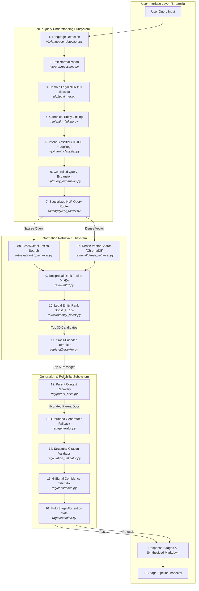
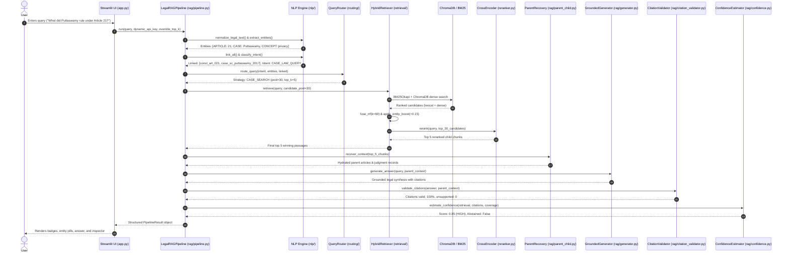

# Indian Constitution Legal AI Assistant — System Architecture & Technical Specification

## 1. Executive System Overview

The **Indian Constitution Legal AI Assistant** is an empirical Natural Language Processing (NLP) and Information Retrieval (IR) framework engineered specifically for Indian Constitutional Law. It addresses unique domain challenges including nested statutory articles, multi-clause provisions, doctrine citations, and extensive judicial precedent interpretation.

The system replaces speculative multi-agent autonomy with a **deterministic, explainable 16-stage NLP Query Understanding and Reliable Retrieval-Augmented Generation (RAG) pipeline**.

```
Research Title: Entity-Aware Hybrid Retrieval and Reranking Framework for Indian Constitutional Question Answering
Target Milestone: B.Tech NLP Senior Capstone Specification
```

---

## 2. End-to-End System Architecture

### 2.1 Complete Pipeline Flowchart (Mermaid)



---

## 3. Sequence Diagram for an Example Query



---

## 4. Component Responsibility & Interface Matrix

| Component Subsystem | Source Module | Primary Class / Function | Inputs | Outputs | Dependencies & Fallbacks |
|---|---|---|---|---|---|
| **Text Normalization** | `nlp/preprocessing.py` | `normalize_legal_text(text: str)` | Raw user query string | Normalized string with standard statutory abbreviations | Regex substitutions; returns raw text on error |
| **Language Detection** | `nlp/language_detection.py` | `detect_language(text: str)` | Normalized query string | Dict: `{'language': 'en', 'is_english': True, 'confidence': float}` | Character script heuristic |
| **Legal Named Entity Recognition** | `nlp/legal_ner.py` | `LegalNER.extract_entities(text: str)` | Normalized query string | Dict mapping 10 categories to entity string lists | Hybrid regex + corpus gazetteers |
| **Canonical Entity Linking** | `nlp/entity_linking.py` | `CanonicalEntityLinker.link_all(entities: dict)` | Extracted entities dictionary | List of structured canonical linked dicts with corpus IDs | Inverted alias table (`parent_store.json`) |
| **Intent Classification** | `nlp/intent_classifier.py` | `IntentClassifier.predict(text: str)` | Normalized query string | Dict: `{'intent': str, 'confidence': float, 'strategy': str}` | TF-IDF (1,2) + LogReg; keyword fallback |
| **Controlled Query Expansion** | `nlp/query_expansion.py` | `ControlledQueryExpander.expand_query(text: str)` | Normalized query string | Expanded query string with at most 3 curated legal synonyms | Synonym graph in `nlp/legal_synonyms.json` |
| **Specialized NLP Query Router** | `routing/query_router.py` | `NLPQueryRouter.route(query, intent, entities)` | Query text, intent dict, entity lists | `RoutingDecision` dataclass with retrieval flags and candidate pool size | Rule engine; defaults to `HYBRID_SEARCH` |
| **Lexical BM25 Search** | `retrieval/bm25_retriever.py` | `BM25Retriever.retrieve(query, top_k)` | Query string, top-$K$ cutoff | Ranked list of chunk candidate dicts with normalized scores | In-memory `BM25Okapi` index over child texts |
| **Dense Vector Search** | `retrieval/dense_retriever.py` | `DenseRetriever.retrieve(query, top_k)` | Query string, top-$K$ cutoff | Ranked list of chunk candidate dicts with cosine similarity scores | `all-MiniLM-L6-v2` + ChromaDB persistent collection |
| **Reciprocal Rank Fusion** | `retrieval/rrf.py` | `fuse(rank_lists, k=60)` | Multiple ranked candidate lists | Unified candidate list sorted by descending RRF score | Rank fusion formula ($k=60$) |
| **Legal Entity Rank Boost** | `retrieval/entity_boost.py` | `apply_entity_boost(candidates, entities, weight=0.15)` | RRF candidates, linked entity IDs | Reordered candidates with additive $+0.15$ entity score | Metadata matching against canonical IDs |
| **Cross-Encoder Neural Reranking** | `retrieval/reranker.py` | `CrossEncoderReranker.rerank(query, candidates, top_k)` | Query string, top-30 candidate passages | Top-5 reranked candidate passages | `cross-encoder/ms-marco-MiniLM-L-6-v2` on CPU |
| **Parent Context Recovery** | `rag/parent_child.py` | `ParentChildRecovery.recover_context(chunks)` | Top-5 winning child chunk dicts | Consolidated parent records with full clauses and judgment facts | Lookups in `parent_store.json` |
| **Grounded Generator** | `rag/generator.py` | `GroundedGenerator.generate_answer(query, context)` | User query, recovered parent records | Markdown string with explicit citations | Gemini API; falls back to `HeuristicLegalSynthesizer` |
| **Structural Citation Validator** | `rag/citation_validator.py` | `CitationValidator.validate_citations(answer, context)` | Synthesized answer text, hydrated parent context | Dict: `{'valid': bool, 'valid_citations': list, 'invalid_citations': list}` | Regex citation parser + set inclusion |
| **Confidence Estimator** | `rag/confidence.py` | `ConfidenceEstimator.estimate(retrieval, cit, cov)` | Retrieval scores, citation validity, query coverage | Dict: `{'confidence_score': float, 'confidence_level': str}` | 6-signal weighted heuristic |
| **Automated Abstention Gate** | `rag/abstention.py` | `AbstentionManager.evaluate_abstention(...)` | Confidence dict, routing decision, retrieval count | Dict: `{'abstained': bool, 'reason': str, 'message': str}` | Threshold gating ($C < 0.30$) |

---

## 5. Mathematical & Algorithmic Formulations

### 5.1 BM25Okapi Lexical Scoring
For query $Q = \{q_1, \dots, q_n\}$ and document passage $D$:
$$\text{BM25}(D, Q) = \sum_{i=1}^{n} \text{IDF}(q_i) \cdot \frac{f(q_i, D) \cdot (k_1 + 1)}{f(q_i, D) + k_1 \cdot \left(1 - b + b \cdot \frac{|D|}{\text{avgdl}}\right)}$$
where:
$$\text{IDF}(q_i) = \ln\left(1 + \frac{N - n(q_i) + 0.5}{n(q_i) + 0.5}\right)$$
Configured parameters: $k_1 = 1.5, b = 0.75$.

### 5.2 Dense Embedding Similarity
Dense vectors are generated via `sentence-transformers/all-MiniLM-L6-v2` ($\mathbf{v} \in \mathbb{R}^{384}$). Cosine similarity between query embedding $\mathbf{q}$ and passage embedding $\mathbf{d}$:
$$\text{CosineSim}(\mathbf{q}, \mathbf{d}) = \frac{\mathbf{q} \cdot \mathbf{d}}{\|\mathbf{q}\|_2 \|\mathbf{d}\|_2}$$
Since ChromaDB stores HNSW cosine distance $\delta \in [0, 2]$, similarity is computed as $s = 1 - \delta$.

### 5.3 Reciprocal Rank Fusion (RRF)
Combines lexical and dense candidate lists $M = \{\text{BM25}, \text{Dense}\}$:
$$\text{RRF\_Score}(d) = \sum_{m \in M} \frac{1}{k + r_m(d)}$$
where $k = 60$ and $r_m(d) \in \{1, 2, \dots, K\}$ is the 1-based rank of passage $d$ in retriever $m$.

### 5.4 Legal Entity Additive Boost
Passages matching canonical legal entities extracted from the query receive an additive score boost:
$$\text{Score}_{\text{boosted}}(d) = \text{Score}_{\text{RRF}}(d) + \omega_{\text{boost}} \cdot \mathbb{I}(d \in \text{LinkedEntities}(Q))$$
where $\omega_{\text{boost}} = 0.15$.

### 5.5 Cross-Encoder Neural Reranking
Top-30 candidate passages from entity-boosted RRF are reranked using `cross-encoder/ms-marco-MiniLM-L-6-v2`:
$$s_{\text{rerank}}(Q, d) = \sigma\left(\mathbf{W} \cdot \text{Transformer}([CLS] \circ Q \circ [SEP] \circ d \circ [SEP])\right)$$
The top 5 passages by $s_{\text{rerank}}$ are passed to Context Recovery.

### 5.6 Explainable Confidence Heuristic
$$\text{Confidence}(Q) = \sum_{i=1}^6 \omega_i \cdot s_i$$
- Retrieval strength ($s_1$, $\omega_1 = 0.25$)
- Retrieved evidence count ($s_2$, $\omega_2 = 0.15$)
- Entity alignment ($s_3$, $\omega_3 = 0.20$)
- BM25/Dense rank agreement ($s_4$, $\omega_4 = 0.15$)
- Citation validity ($s_5$, $\omega_5 = 0.15$)
- Query coverage ($s_6$, $\omega_6 = 0.10$)

*Disclosure: Confidence estimation is an explainable decision heuristic, not a mathematically calibrated posterior probability.*

---

## 6. Offline Ingestion vs. Online Query Execution

```
========================================================================================
OFFLINE INGESTION (scripts/ingest_data.py)
========================================================================================
data/constitution/articles.json (137) ──┐
data/constitution/amendments.json (18)  ├──► LegalStructureChunker ──► parent_store.json (270 parents)
data/judgments/landmarks.json (104)   ──┘       (rag/chunking.py)   ──► ChromaDB (1,001 vectors)
                                                                    ──► BM25 Index (1,001 passages)

========================================================================================
ONLINE QUERY EXECUTION (app.py -> rag/pipeline.py)
========================================================================================
User Input ──► NLP Understanding ──► Dual Retrieval ──► RRF + Boost ──► Cross-Encoder
                                                                            │ (Top 5 Chunks)
                                                                            ▼
UI Output  ◄── Validation & Conf ◄── LLM Synthesis  ◄── Parent Hydration ◄──┘
```

---

## 7. Data Models & Entity Relationships

```text
[Parent Document (parent_store.json)]
  ├── parent_id: "const_art_021" / "case_sc_puttaswamy_privacy_2017"
  ├── doc_type: "constitution" | "judgment" | "amendment"
  ├── full_text: Complete legal text (clauses, explanation, facts, ratio, verdict)
  └── metadata: { article_number, part, bench, citation, year, provenance }
        │
        └─── has many ──► [Child Passage (ChromaDB & BM25)]
                            ├── child_id: "child_const_const_art_021_0"
                            ├── parent_id: "const_art_021" (Foreign Key link)
                            ├── text: ~300 character passage
                            └── embedding: 384-dimensional dense vector
```
